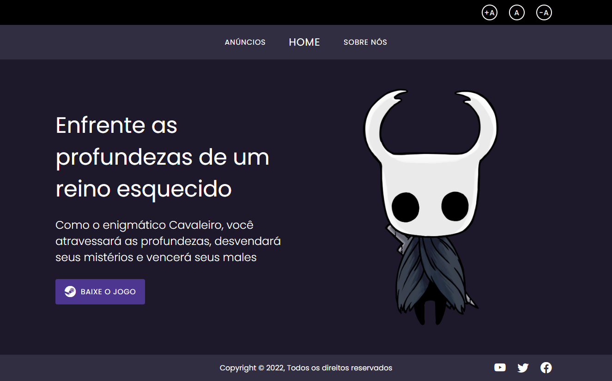

  
   

    
  
   ## 💻 **Acesse o Site [aqui](https://hollow-knight-challenge.vercel.app)** 💻
  

## 📑 Índice
- [Sobre o Projeto](#-sobre-o-projeto)
- [Tecnologias utilizadas](#-tecnologias-utilizadas)
- [Executar na sua máquina](#-executar-na-sua-máquina)
- [Licença](#-licença)
  

## 💡 Sobre o Projeto

Este site foi pensado durante o **Lead Mentoring*, projeto da [LeadDell](https://leadfortaleza.com.br/portal), como forma de praticar conceitos básicos de JavaScript, HTML, CSS e acessibilidade na web. Como forma de práticar a manipulação do DOM todos os componentes de conteúdo da páginas foram gerados via JavaScript. Além disso, Tendo em vista usuário com problemas de visão, foi implementado um mecanismo de modificação do tamanho da fonte via uma barra de acessibilidade no topo do site.
  
## 🚀 Tecnologias utilizadas

O projeto foi desenvolvido utilizando as seguintes tecnologias:

- JavaScript
- HTML5
- CSS3
  

## 📥 Executar na sua máquina

- Clonar Repositório: `git clone https://github.com/VictorM-Coder/hollow-knight-challenge.git`
      

## 📕 Licença

Todos os arquivos incluídos aqui, incluindo este _README_, estão sob [Licença MIT](./LICENSE). 
Criado por [Victor Martins](https://github.com/VictorM-Coder)
